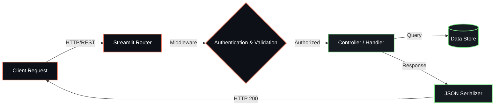

<div align="center">


<p align="center">
  
  
  
  
</p>

  


</div>

---

## Overview

> Analytics dashboard for processing national-scale demographic data.

**UIDAI Hackathon Solution** is a proprietary api / backend service system engineered by **Karthik Idikuda**. It leverages Streamlit for its core functionality.

<br/>

## System Architecture



<br/>

## Project Structure

```
UIDAI-Hackathon-Solution/
  .DS_Store
  LICENSE
  README.md
  app.py
  icons.py
  profile.jpeg
  requirements.txt
  styles.py
  uidai_logo.png
  utils.py
  __pycache__/
    icons.cpython-311.pyc
    styles.cpython-311.pyc
    utils.cpython-311.pyc
  api_data_aadhar_biometric/
    api_data_aadhar_biometric_0_500000.csv
    api_data_aadhar_biometric_1000000_1500000.csv
    api_data_aadhar_biometric_1500000_1861108.csv
    api_data_aadhar_biometric_500000_1000000.csv
  api_data_aadhar_demographic/
    api_data_aadhar_demographic_0_500000.csv
    api_data_aadhar_demographic_1000000_1500000.csv
    api_data_aadhar_demographic_1500000_2000000.csv
    api_data_aadhar_demographic_2000000_2071700.csv
    api_data_aadhar_demographic_500000_1000000.csv
  api_data_aadhar_enrolment/
    api_data_aadhar_enrolment_0_500000.csv
    api_data_aadhar_enrolment_1000000_1006029.csv
    api_data_aadhar_enrolment_500000_1000000.csv
  page_modules/
    anomaly_detection.py
    biometrics.py
    dashboard.py
    demographics.py
    enrolment.py
```

<br/>

## Technical Specifications

| Attribute | Detail |
|:---|:---|
| **Primary Language** | `Python` |
| **Project Category** | `API / Backend Service` |
| **Total Source Files** | `37` |
| **Frameworks** | `Streamlit` |
| **Key Dependencies** | `numpy` | `scikit-learn` | `pandas` | `plotly` | `streamlit` | `python-dateutil` | `openpyxl` |
| **Intellectual Property** | `Strictly Proprietary` |

<br/>

## STRICT LEGAL WARNING & LICENSE

> **PROPRIETARY AND CONFIDENTIAL**

This software and all associated documentation are the **exclusive property of Karthik Idikuda**.

- **NO PERMISSION IS GRANTED** to use, copy, modify, merge, publish, distribute, sublicense, or sell copies of this software without explicit, written consent from the author.
- **UNAUTHORIZED USE WILL RESULT IN SEVERE LEGAL ACTION.** Any individual or organization found using, referencing, or deploying this code without paying the required licensing fees will face immediate litigation, financial penalties, and potentially criminal prosecution where applicable by law.
- **TO OBTAIN A LEGAL LICENSE**, you must directly contact Karthik Idikuda to negotiate payment terms.

*By accessing this repository, you acknowledge and accept these strict proprietary terms.*

---

<div align="center">
  
</div>

<!-- TRACKING: S0ktVUlEQUktSGFja2F0aG9uLVNvbHV0aW9uLVRSQUNL -->
